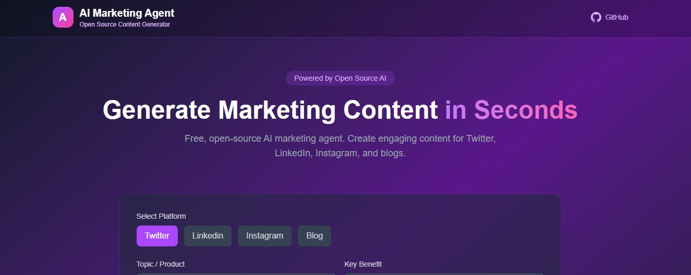

# AI Marketing Agent

Open-source AI agent that democratizes marketing automation for small businesses and creators.

**Live Demo:** [ai-marketing-agent-demo.vercel.app](https://ai-marketing-agent-demo.vercel.app)



## Problem

Enterprise AI marketing tools cost $500-2000/month, excluding 90% of small businesses and solo creators from professional-grade marketing capabilities.

## Solution

An open-source, community-owned AI agent that automates:
- **Content Generation** - Blog posts, social media, ads tailored to your brand voice
- **Audience Analytics** - Engagement patterns, optimal posting times, demographic insights
- **Campaign Optimization** - Autonomous A/B testing and budget allocation

## Tech Stack

- Next.js / React
- Tailwind CSS
- TypeScript
- Open-source LLMs (Llama, Mistral)
- Sentient OML Framework (planned)

## Getting Started

```bash
npm install
npm run dev
```

Open [http://localhost:3000](http://localhost:3000) with your browser to see the result.

## Roadmap

- [x] Phase 1: Core content generation MVP
- [x] Phase 2: Multi-platform support (Twitter, LinkedIn, Instagram)
- [ ] Phase 3: Autonomous optimization loop
- [ ] Phase 4: Sentient ecosystem integration
- [ ] Phase 5: Public beta launch

## Contributing

Contributions welcome! This project aims to be community-owned and open to all.

## License

MIT
